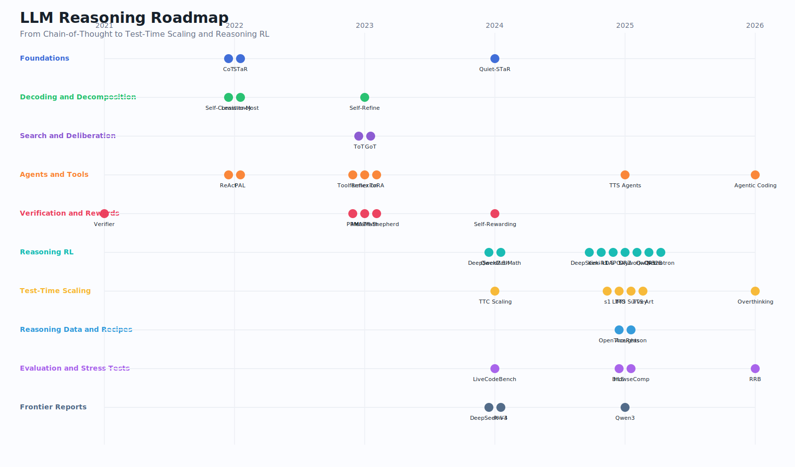
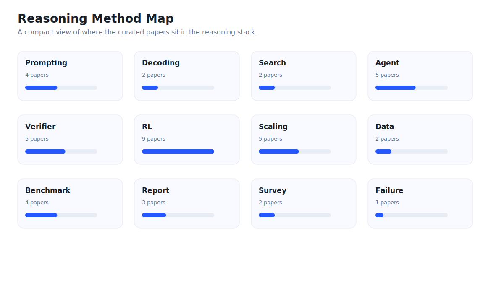

# Awesome LLM Reasoning Roadmap

<div align="center">

**From Chain-of-Thought to Test-Time Scaling and Reasoning RL.**

   

[Visual roadmap](#visual-roadmap) · [Reading tracks](#reading-tracks) · [Paper atlas](#paper-atlas) · [Searchable page](docs/index.html) · [Data](data/papers.json)

</div>

> A focused, visual reading map for LLM reasoning papers. If this helps your reading, reproduction, or research planning, please consider starring the repo and following [@StaryMoon](https://github.com/StaryMoon).

## Why This Repo

The LLM reasoning literature is no longer one neat topic. It now mixes prompting, decomposition, search, tool use, verifiers, process rewards, test-time scaling, and RL systems. This repo is a focused map for that stack.

What makes it different from a normal awesome list:

- **One clear theme**: LLM reasoning, not a broad AI dump.
- **Visual-first structure**: timeline and method-map SVGs are generated from the dataset.
- **Reading routes**: each route explains who should read it and what to compare.
- **Code-aware atlas**: paper links, official code, and StaryMoon unofficial repos are shown together when available.
- **Machine-readable data**: all entries live in `data/papers.json` and `data/tracks.json`.

## Visual Roadmap





## Adoption / Related PRs

| Repository | PR | Status | Context |
|---|---|---|---|
| `atfortes/Awesome-LLM-Reasoning` | [#78](https://github.com/atfortes/Awesome-LLM-Reasoning/pull/78) | Open | Adds this visual roadmap as a related reasoning resource. |
| `mbzuai-oryx/Awesome-LLM-Post-training` | [#30](https://github.com/mbzuai-oryx/Awesome-LLM-Post-training/pull/30) | Open | Adds this roadmap to post-training and reasoning-resource references. |
| `4IK1d/awesome-llm-reasoning` | [#2](https://github.com/4IK1d/awesome-llm-reasoning/pull/2) | Open | Adds the roadmap in the related awesome-list section. |

## Reading Tracks

| Track | Good for | Why it is hot | Route |
|---|---|---|---|
| [Start Here: CoT to Self-Consistency](docs/tracks/start-here.md) | Students and engineers who want the shortest path from prompting to modern reasoning terminology. | Almost every recent reasoning paper still uses CoT, self-consistency, and decomposition as its baseline vocabulary. | `CoT`, `Self-Consistency`, `Least-to-Most`, `STaR`, `Quiet-STaR` |
| [Deliberate Search: Trees, Graphs, and Test-Time Compute](docs/tracks/deliberate-search.md) | Readers interested in budget forcing, inference-time search, and non-greedy reasoning. | Test-time scaling is one of the clearest bridges between old reasoning prompts and current reasoning models. | `ToT`, `GoT`, `TTC Scaling`, `s1`, `LIMO`, `TTS Survey`, `TTS Art`, `Overthinking` |
| [Agents, Tools, and Executable Reasoning](docs/tracks/agents-tools-programs.md) | Agent builders, tool-use researchers, and people interested in executable reasoning traces. | Tool-use and agent workflows are where reasoning becomes visible as actions instead of only text. | `ReAct`, `PAL`, `Toolformer`, `Reflexion`, `Self-Refine`, `ToRA`, `TTS Agents`, `Agentic Coding` |
| [Verifiers, Process Rewards, and Self-Judging Models](docs/tracks/verifiers-process-rewards.md) | Readers interested in PRMs, reward modeling, math verification, and scalable supervision. | Reasoning RL needs reward signals; process supervision is one of the main ways to make those rewards less sparse. | `Verifier`, `PRM`, `MetaMath`, `MATH-Shepherd`, `Self-Rewarding` |
| [Reasoning RL Systems: GRPO, Long-CoT, and Open Reasoners](docs/tracks/reasoning-rl-systems.md) | LLM researchers tracking modern RL recipes for math, code, and long-chain reasoning. | This is the current high-traffic cluster: reasoning ability as an RL-trained behavior rather than only a prompt trick. | `DeepSeekMath`, `DeepSeek-R1`, `Kimi k1.5`, `QwQ-32B`, `Nemotron`, `DAPO`, `ORZ`, `Skywork-OR1` |
| [Reasoning Data Recipes: Small Data, Open Data, and SFT/RL Synergy](docs/tracks/reasoning-data-recipes.md) | Students, reproduction builders, and open-source practitioners trying to assemble training data or starter pipelines. | After DeepSeek-R1, many readers want recipes, not just model names: data filtering, distillation, SFT, and RL are the buy-in points. | `Qwen2.5-Math`, `LIMO`, `OpenThoughts`, `AceReason`, `s1` |
| [Benchmarks and Stress Tests: Code, Browsing, Expert Exams, and Robustness](docs/tracks/benchmarks-stress-tests.md) | Readers who want to evaluate reasoning models, write reproduction reports, or avoid benchmark theater. | Hard benchmarks and robustness tests are what turn reasoning hype into something comparable. | `LiveCodeBench`, `HLE`, `BrowseComp`, `RRB`, `Overthinking` |
| [Frontier Reports Context: Base Models and Reasoning Modes](docs/tracks/frontier-reports-context.md) | People comparing frontier model reports, base model design, synthetic data, and reasoning modes. | Reasoning ability is now marketed and engineered as part of frontier model families, not just separate math models. | `DeepSeek-V3`, `Phi-4`, `Qwen3`, `Qwen2.5-Math` |

## Paper Atlas

### Foundations

| Year | Paper | Track | Stage | Code | Tags |
|---:|---|---|---|---|---|
| 2022 | [Chain-of-Thought Prompting Elicits Reasoning in Large Language Models](https://arxiv.org/abs/2201.11903) | Foundations | Prompting | - | chain-of-thought, prompting, few-shot, math, reasoning |
| 2022 | [STaR: Bootstrapping Reasoning With Reasoning](https://arxiv.org/abs/2203.14465) | Foundations | Prompting | [Official](https://github.com/ezelikman/STaR) | bootstrapping, rationale, self-training, reasoning |
| 2024 | [Quiet-STaR: Language Models Can Teach Themselves to Think Before Speaking](https://arxiv.org/abs/2403.09629) | Foundations | Prompting | [Official](https://github.com/ezelikman/quiet-star) | latent-reasoning, rationale, self-training, thoughts |

### Decoding and Decomposition

| Year | Paper | Track | Stage | Code | Tags |
|---:|---|---|---|---|---|
| 2022 | [Self-Consistency Improves Chain of Thought Reasoning in Language Models](https://arxiv.org/abs/2203.11171) | Decoding and Decomposition | Decoding | - | self-consistency, decoding, sampling, chain-of-thought, math |
| 2022 | [Least-to-Most Prompting Enables Complex Reasoning in Large Language Models](https://arxiv.org/abs/2205.10625) | Decoding and Decomposition | Prompting | - | decomposition, prompting, subproblems, compositionality |
| 2023 | [Self-Refine: Iterative Refinement with Self-Feedback](https://arxiv.org/abs/2303.17651) | Decoding and Decomposition | Decoding | [Official](https://github.com/madaan/self-refine) | self-feedback, revision, iterative, decoding, reasoning |

### Search and Deliberation

| Year | Paper | Track | Stage | Code | Tags |
|---:|---|---|---|---|---|
| 2023 | [Tree of Thoughts: Deliberate Problem Solving with Large Language Models](https://arxiv.org/abs/2305.10601) | Search and Deliberation | Search | [Official](https://github.com/princeton-nlp/tree-of-thought-llm) | tree-search, deliberation, planning, reasoning |
| 2023 | [Graph of Thoughts: Solving Elaborate Problems with Large Language Models](https://arxiv.org/abs/2308.09687) | Search and Deliberation | Search | [Official](https://github.com/spcl/graph-of-thoughts) | graph-of-thoughts, search, deliberation, reasoning |

### Agents and Tools

| Year | Paper | Track | Stage | Code | Tags |
|---:|---|---|---|---|---|
| 2022 | [ReAct: Synergizing Reasoning and Acting in Language Models](https://arxiv.org/abs/2210.03629) | Agents and Tools | Agent | [Official](https://github.com/ysymyth/ReAct) | agent, tool-use, reasoning, acting, environment |
| 2022 | [Program-Aided Language Models](https://arxiv.org/abs/2211.10435) | Agents and Tools | Agent | [Official](https://github.com/reasoning-machines/pal) | program-aided, tool-use, python, math, reasoning |
| 2023 | [Toolformer: Language Models Can Teach Themselves to Use Tools](https://arxiv.org/abs/2302.04761) | Agents and Tools | Agent | - | tool-use, self-supervision, api, agent |
| 2023 | [Reflexion: Language Agents with Verbal Reinforcement Learning](https://arxiv.org/abs/2303.11366) | Agents and Tools | Agent | [Official](https://github.com/noahshinn/reflexion) | agent, reflection, memory, verbal-rl, self-improvement |
| 2023 | [ToRA: A Tool-Integrated Reasoning Agent for Mathematical Problem Solving](https://arxiv.org/abs/2309.17452) | Agents and Tools | Agent | [Official](https://github.com/microsoft/ToRA) | math, tool-use, agent, program, reasoning |
| 2025 | [Scaling Test-Time Compute for LLM Agents](https://arxiv.org/abs/2506.12928) | Agents and Tools | Scaling | - | agent, test-time-compute, tool-use, scaling, workflow |
| 2026 | [Scaling Test-Time Compute Optimally in LLM Agentic Coding](https://arxiv.org/abs/2604.16529) | Agents and Tools | Scaling | - | coding-agent, test-time-compute, agent, scaling, code |

### Verification and Rewards

| Year | Paper | Track | Stage | Code | Tags |
|---:|---|---|---|---|---|
| 2021 | [Training Verifiers to Solve Math Word Problems](https://arxiv.org/abs/2110.14168) | Verification and Rewards | Verifier | - | verifier, math, reranking, reward-model, reasoning |
| 2023 | [Let's Verify Step by Step](https://arxiv.org/abs/2305.20050) | Verification and Rewards | Verifier | - | process-supervision, prm, math, verifier, reward-model |
| 2023 | [MetaMath: Bootstrap Your Own Mathematical Questions for Large Language Models](https://arxiv.org/abs/2309.12284) | Verification and Rewards | Verifier | [Official](https://github.com/meta-math/MetaMath) | math, data-augmentation, bootstrapping, instruction-tuning |
| 2023 | [MATH-Shepherd: Verify and Reinforce LLMs Step-by-step without Human Annotations](https://arxiv.org/abs/2312.08935) | Verification and Rewards | Verifier | [Official](https://github.com/peiyi9979/math-shepherd) | math, process-reward, verification, step-level, self-supervision |
| 2024 | [Self-Rewarding Language Models](https://arxiv.org/abs/2401.10020) | Verification and Rewards | Verifier | - | self-reward, preference, judge, alignment, reasoning |

### Reasoning RL

| Year | Paper | Track | Stage | Code | Tags |
|---:|---|---|---|---|---|
| 2024 | [DeepSeekMath: Pushing the Limits of Mathematical Reasoning in Open Language Models](https://arxiv.org/abs/2402.03300) | Reasoning RL | RL | [Official](https://github.com/deepseek-ai/DeepSeek-Math) | math, grpo, rl, open-model, deepseek |
| 2024 | [Qwen2.5-Math Technical Report: Toward Mathematical Expert Model via Self-Improvement](https://arxiv.org/abs/2409.12122) | Reasoning RL | RL | [Official](https://github.com/QwenLM/Qwen2.5-Math) | math, qwen, self-improvement, open-model, reasoning |
| 2025 | [DeepSeek-R1: Incentivizing Reasoning Capability in LLMs via Reinforcement Learning](https://arxiv.org/abs/2501.12948) | Reasoning RL | RL | [Official](https://github.com/deepseek-ai/DeepSeek-R1) / [Unofficial](https://github.com/StaryMoon/DeepSeek-R1-Unofficial) | deepseek-r1, rl, grpo, long-cot, distillation |
| 2025 | [Kimi k1.5: Scaling Reinforcement Learning with LLMs](https://arxiv.org/abs/2501.12599) | Reasoning RL | RL | [Unofficial](https://github.com/StaryMoon/Kimi-k1-5-Unofficial) | kimi, rl, long-context, reasoning, multimodal |
| 2025 | [DAPO: An Open-Source LLM Reinforcement Learning System at Scale](https://arxiv.org/abs/2503.14476) | Reasoning RL | RL | [Unofficial](https://github.com/StaryMoon/DAPO-Unofficial) | dapo, rl, policy-optimization, reasoning, system |
| 2025 | [Open-Reasoner-Zero: An Open Source Approach to Scaling Up Reinforcement Learning on the Base Model](https://arxiv.org/abs/2503.24290) | Reasoning RL | RL | [Unofficial](https://github.com/StaryMoon/Open-Reasoner-Zero-Unofficial) | open-source, rl, base-model, reasoning, ppo |
| 2025 | [Skywork Open Reasoner 1 Technical Report](https://arxiv.org/abs/2505.22312) | Reasoning RL | RL | [Unofficial](https://github.com/StaryMoon/Skywork-OR1-Unofficial) | skywork, long-cot, math, code, rl |
| 2025 | [QwQ-32B: Embracing the Power of Reinforcement Learning](https://qwenlm.github.io/blog/qwq-32b/) | Reasoning RL | RL | [Official](https://github.com/QwenLM/Qwen) | qwen, qwq, rl, open-model, reasoning |
| 2025 | [Llama-Nemotron: Efficient Reasoning Models](https://arxiv.org/abs/2505.00949) | Reasoning RL | RL | [Official](https://github.com/NVIDIA/NeMo) | nemotron, nvidia, efficient-reasoning, distillation, open-model |

### Test-Time Scaling

| Year | Paper | Track | Stage | Code | Tags |
|---:|---|---|---|---|---|
| 2024 | [Scaling LLM Test-Time Compute Optimally can be More Effective than Scaling Model Parameters](https://arxiv.org/abs/2408.03314) | Test-Time Scaling | Scaling | - | test-time-compute, scaling, inference, search, reasoning |
| 2025 | [s1: Simple test-time scaling](https://arxiv.org/abs/2501.19393) | Test-Time Scaling | Scaling | [Official](https://github.com/simplescaling/s1) / [Unofficial](https://github.com/StaryMoon/s1-Test-Time-Scaling-Unofficial) | test-time-scaling, budget-forcing, reasoning, inference |
| 2025 | [LIMO: Less is More for Reasoning](https://arxiv.org/abs/2502.03387) | Test-Time Scaling | Scaling | [Official](https://github.com/GAIR-NLP/LIMO) / [Unofficial](https://github.com/StaryMoon/LIMO-Unofficial) | data-efficiency, reasoning, math, scaling, sft |
| 2025 | [A Survey on Test-Time Scaling in Large Language Models: What, How, Where, and How Well?](https://arxiv.org/abs/2503.24235) | Test-Time Scaling | Survey | - | survey, test-time-scaling, inference, reasoning, compute |
| 2025 | [The Art of Scaling Test-Time Compute for LLMs](https://arxiv.org/abs/2512.02008) | Test-Time Scaling | Survey | - | test-time-compute, scaling, survey, budget, inference |
| 2026 | [Does More Inference-Time Compute Really Help Robust Reasoning?](https://arxiv.org/abs/2604.10739) | Test-Time Scaling | Failure | - | overthinking, test-time-compute, robustness, failure-mode, reasoning |

### Reasoning Data and Recipes

| Year | Paper | Track | Stage | Code | Tags |
|---:|---|---|---|---|---|
| 2025 | [OpenThoughts: Data Recipes for Reasoning Models](https://arxiv.org/abs/2506.04178) | Reasoning Data and Recipes | Data | [Official](https://github.com/open-thoughts/open-thoughts) | reasoning-data, open-data, recipe, math, code |
| 2025 | [AceReason-Nemotron: Advancing Math and Code Reasoning through SFT and RL Synergy](https://arxiv.org/abs/2505.16400) | Reasoning Data and Recipes | Data | - | sft, rl, math, code, reasoning-data |

### Evaluation and Stress Tests

| Year | Paper | Track | Stage | Code | Tags |
|---:|---|---|---|---|---|
| 2024 | [LiveCodeBench: Holistic and Contamination Free Evaluation of Large Language Models for Code](https://arxiv.org/abs/2403.07974) | Evaluation and Stress Tests | Benchmark | [Official](https://github.com/LiveCodeBench/LiveCodeBench) | code, benchmark, evaluation, contamination, reasoning |
| 2025 | [Humanity's Last Exam](https://arxiv.org/abs/2501.14249) | Evaluation and Stress Tests | Benchmark | [Official](https://github.com/centerforaisafety/hle) | benchmark, frontier, expert, evaluation, reasoning |
| 2025 | [BrowseComp: A Simple Yet Challenging Benchmark for Browsing Agents](https://arxiv.org/abs/2504.12516) | Evaluation and Stress Tests | Benchmark | - | benchmark, browser-agent, information-seeking, agent, evaluation |
| 2026 | [Robust Reasoning Benchmark: Assessing LLMs' Mathematical Reasoning Capabilities Against Natural Input Perturbations](https://arxiv.org/abs/2602.09838) | Evaluation and Stress Tests | Benchmark | - | benchmark, robustness, math, perturbation, evaluation |

### Frontier Reports

| Year | Paper | Track | Stage | Code | Tags |
|---:|---|---|---|---|---|
| 2024 | [DeepSeek-V3 Technical Report](https://arxiv.org/abs/2412.19437) | Frontier Reports | Report | [Official](https://github.com/deepseek-ai/DeepSeek-V3) / [Unofficial](https://github.com/StaryMoon/DeepSeek-V3-Unofficial) | moe, mla, technical-report, deepseek, base-model |
| 2025 | [Qwen3 Technical Report](https://arxiv.org/abs/2505.09388) | Frontier Reports | Report | [Official](https://github.com/QwenLM/Qwen3) / [Unofficial](https://github.com/StaryMoon/Qwen3-Unofficial) | qwen3, moe, hybrid-thinking, multilingual, frontier |
| 2024 | [Phi-4 Technical Report](https://arxiv.org/abs/2412.08905) | Frontier Reports | Report | [Unofficial](https://github.com/StaryMoon/Phi-4-Unofficial) | phi-4, synthetic-data, compact-model, stem, reasoning |

## Use the Data

```bash
python scripts/build.py
python -m json.tool data/papers.json
```

The static page at [`docs/index.html`](docs/index.html) provides a searchable table and visual track cards.

## Contribution Ideas

- Add newly released reasoning RL papers.
- Add official code links when authors release them.
- Add benchmark tags for math, code, tool-use, long-context, and multimodal reasoning.
- Add reproduction notes that compare inference-time scaling and training-time RL recipes.

## Disclaimer

This is an independent curated roadmap. Paper names, official code, datasets, models, and trademarks belong to their respective owners. Linked StaryMoon repositories are unofficial unless explicitly stated otherwise.
